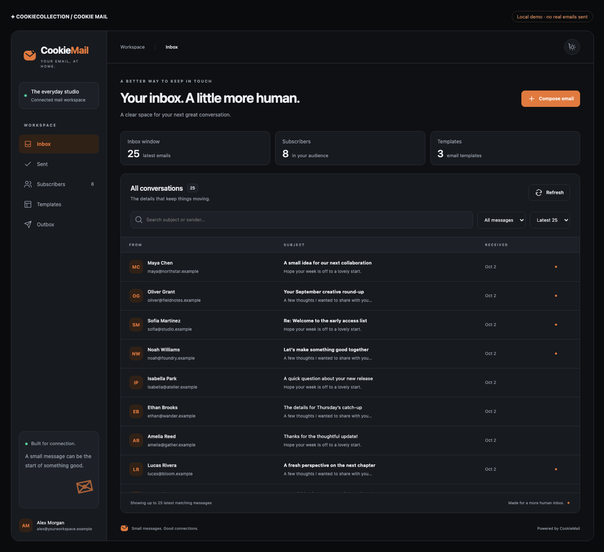
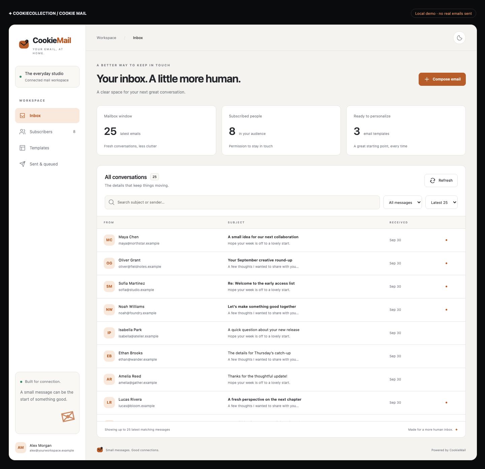
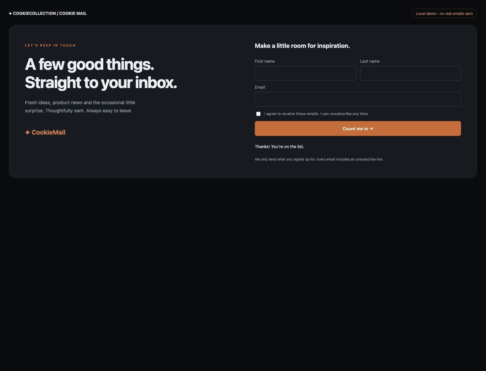
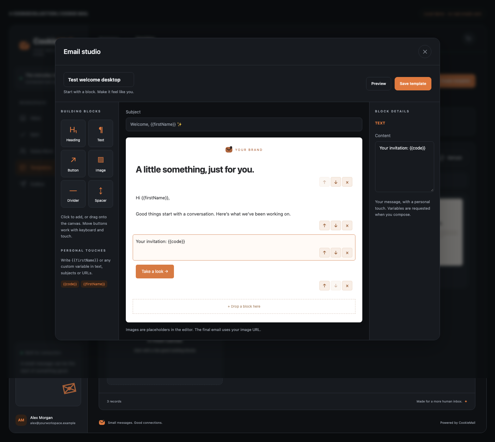

# CookieMail

**Your inbox. A little more human.**

An embeddable email workspace for Node.js and React: a private inbox, tagged subscribers, a visual template studio, and a durable send queue. Bring your own authentication and mailbox. CookieStocks-inspired Carbon & Copper themes follow your app’s light/dark setting.



## What you can do

- Fetch the latest **25 or 50** matching inbox messages. Search subject/sender, filter unread, read and reply.
- Compose plain text, sanitized HTML, or a saved template. Review the recipient/audience before queuing.
- Collect first name, last name and email with explicit consent; organize subscribers with custom tags.
- Send separate personalized messages to everyone subscribed to a tag. Subscriber addresses are never exposed in a shared To/CC field.
- Build templates with draggable **heading, text, button, image, divider and spacer** blocks. Keyboard/touch move buttons provide the same ordering controls.
- Use `{{firstName}}`, `{{productName}}`, or other named variables. The composer automatically creates the required input fields. Tag campaigns fill `firstName`, `lastName`, and `email` from subscribers.
- Use SQLite locally or **Firestore (Firebase/Google Cloud), DynamoDB (AWS), Cosmos DB (Azure), PostgreSQL** in production.

This is a first-version source implementation (`0.1.0`), not a claim that a package has been published under this name. The core is verified locally with a fake mailbox. Real IMAP/SMTP delivery, cloud IAM and deployed cloud databases require your environment’s acceptance checks before production use.

## Run the demo

Node **22.13+** (22 or 24 recommended).

```sh
npm ci
npm run check
npm run demo
```

Open **http://127.0.0.1:3177**. The demo binds only to loopback, signs in a fake operator, and uses in-memory data and fake email delivery. It **never sends real email**. Restarting resets the demo. `/subscribe` demonstrates the embeddable subscription section.

## Install in your Node app

Until a registry release exists, build and install a local tarball:

```sh
# In CookieMail
npm pack
# In your Node app, use the resulting absolute path
npm install /absolute/path/to/cookiemail-0.1.0.tgz
```

Once your release is published, `npm install cookiemail` replaces the tarball step. React is an optional peer; install it only for the UI. Install only the database SDK you use. Import the server API only in server code, never a browser bundle.

```ts
import express from 'express';
import { createCookieMail, imapSmtpProvider } from 'cookiemail';
import { sqliteStore } from 'cookiemail/sqlite';

const app = express();
const mail = createCookieMail({
  store: sqliteStore('./data/mail.sqlite'), // create ./data first
  workspace: 'my-company', // stable partition, not a browser parameter
  publicOrigin: 'https://your-app.example', // exact browser-facing origin, even behind a proxy
  publicBasePath: '/mail-public',
  brand: 'Your company',
  auth: async (req) => {
    const user = await yourVerifiedSession(req); // your existing auth middleware/SDK
    if (!user?.canManageMail) return null;
    return { id: user.id, name: user.name, email: user.email, role: 'admin' };
  },
  provider: imapSmtpProvider({
    from: 'Your Company <hello@your-domain.example>',
    imap: {
      host: process.env.IMAP_HOST!,
      auth: { user: process.env.IMAP_USER!, pass: process.env.IMAP_PASS! },
    },
    smtp: {
      host: process.env.SMTP_HOST!,
      port: 587,
      secure: false,
      auth: { user: process.env.SMTP_USER!, pass: process.env.SMTP_PASS! },
    },
  }),
  logger: console,
});
app.use('/api/mail', mail.router); // private, host-authenticated operator API
app.use('/mail-public', mail.publicRouter); // ONLY token-based unsubscribe endpoints
```

`role: 'viewer'` permits read-only access to inbox/audience/templates/outbox; only `admin` can write or send. Mount the private React page behind your host’s authorization too. Credentials remain in server environment/secret manager configuration. No public inbox or subscriber-list route is created.

`auth` must verify session cookies or bearer tokens, permissions and any MFA policy itself. Do not trust a supplied user ID, tenant or role. One configured instance connects one mailbox and one trusted `workspace` partition. For multiple tenants, select instances using a verified server-side tenant mapping.

The IMAP adapter uses TLS on port 993. SMTP requires verified TLS (465 implicit TLS or 587 STARTTLS). An OAuth access token can be passed as IMAP `auth.accessToken`; the host owns token refresh and provider consent. Native Gmail API / Microsoft Graph OAuth onboarding is not included. Receiving means fetching the connected mailbox on page load/Refresh; there is no background push listener.

## Embed the panel in React

```tsx
import { CookieMail } from 'cookiemail/react';
import 'cookiemail/react.css';

export function MailPage() {
  const [theme, setTheme] = useYourAppTheme();
  return (
    <CookieMail
      key={currentUser.uid} // unmount private state when the signed-in identity changes
      basePath="/api/mail"
      theme={theme}
      onThemeChange={setTheme}
      getToken={() => currentUser.getIdToken()}
      onUnauthorized={() => navigate('/login')}
    />
  );
}
```

Omit `getToken` for same-origin cookie sessions. Omit theme props for an independent locally remembered theme (dark by default). A controlled theme without `onThemeChange` hides the local toggle. Styles use `cm-` class names and `--cm-` variables to avoid host toolbar/brand collisions. Requests use same-origin paths; set `publicOrigin` to your browser URL, including the port locally.



## Add a subscription section

**The visitor never calls the private mailbox API.** Add a small host endpoint that performs your CAPTCHA/bot checks and fixes the tags on the server. The reusable [integration example](examples/integration.ts) includes origin checks, rate limiting, body limits and an injected signup verifier.

```ts
// After your body parser, rate limiter and signup verification:
await mail.subscribe({
  firstName: req.body.firstName,
  lastName: req.body.lastName,
  email: req.body.email,
  consent: req.body.consent, // must be literal true from an explicit checkbox
  source: 'homepage-newsletter',
  tags: ['Newsletter', 'Website'], // chosen by your SERVER, never spread req.body
});
res.json({ ok: true });
```

```tsx
import { SubscribeForm } from 'cookiemail/react';
import 'cookiemail/react.css';

<section>
  <h2>A few good things, in your inbox.</h2>
  <p>Join our newsletter. Leave whenever you like.</p>
  <SubscribeForm action="/subscribe" label="Join the newsletter" />
</section>;
```

The form posts `{ firstName, lastName, email, consent }` as JSON to your endpoint. For CAPTCHA, use your own form to collect the provider token and verify it in your server endpoint, or use your existing verified-session signup flow. This helper does not invent a CAPTCHA bypass.

Email addresses are normalized/deduplicated within the workspace; repeated signups merge tags. Subscriber consent/source/time are recorded. Unsubscribed addresses are **not silently reactivated** by another form submission; a separately verified re-consent process is needed. Double opt-in confirmation emails are not implemented yet. Do not import an audience without their permission.

### Put the signup form in your footer (or any page)

Use a shared layout to show it across your whole website. The form is independent of the private mail panel: visitors do not need operator access, and no inbox UI appears on the public page.

```tsx
import { SubscribeForm } from 'cookiemail/react';
import 'cookiemail/react.css';

export function SiteLayout({ children }) {
  return (
    <>
      <main>{children}</main>
      <footer className="cm-signup-footer" data-theme="dark">
        <div className="cm-signup-copy">
          <span className="cm-signup-label">LET’S KEEP IN TOUCH</span>
          <h2>
            A few good things.
            <br />
            Straight to your inbox.
          </h2>
          <p>Product news and thoughtful updates. Unsubscribe any time.</p>
        </div>
        <div className="cm-signup-card">
          <h3>Join our newsletter</h3>
          <SubscribeForm action="/subscribe" label="Count me in →" />
        </div>
      </footer>
    </>
  );
}
```

Use `data-theme={yourAppTheme}` to match your website. Place the same `SubscribeForm` on a landing page, article page, sidebar or modal. A complete styled component is in [examples/footer-signup.tsx](examples/footer-signup.tsx); change its local source import to `cookiemail/react` when copying it to your host app.

**Wire `/subscribe` to the Node route shown above.** The footer sends names, email and the consent checkbox; the server assigns `tags: ['Newsletter', 'Website']`. If you need separate audiences, create `/subscribe/product-updates` and `/subscribe/events` host routes with their own fixed tags, then set the form’s `action` accordingly. Never let a public visitor supply arbitrary tags or bypass consent/bot validation.

After submitting, open the private **Subscribers** panel to see the person and tags. To email this group: **Compose email → Subscriber tag → Newsletter**, then choose free text, HTML or a template. **Confirm & queue** creates the campaign; the scheduled worker (or operator’s **Process next 10**) sends it.

Preview this footer locally at **http://127.0.0.1:3177/subscribe** after `npm run demo`.



### Tags and campaigns

In **Subscribers**, add a person or click an existing subscriber to edit comma-separated tags. In **Compose email**, choose **Subscriber tag**, then select a tag. Only subscribed members are included. They are checked again just before delivery, so an opt-out after queuing suppresses delivery. Current limits: 12 tags/subscriber, 500 recipients/campaign, 5,000 records per workspace collection scan.

Each campaign email includes an unsubscribe link and List-Unsubscribe headers. The link’s GET displays confirmation; POST unsubscribes, including the standard one-click request. Deploy `publicRouter` at the configured `publicBasePath`, publicly reachable over HTTPS. It never exposes subscription records or tokens in the admin list API.

## Build and use a template

1. Open **Templates → Create template**. Give it a name and subject.
2. Click a widget or drag it onto the canvas. Click a block to edit text/URL in Block details.
3. Reorder by dragging a block or using its ↑/↓ controls. Both work with keyboard/touch.
4. Add variables such as `Hello {{firstName}}` or `Meet {{productName}}`. Names use letters, numbers and underscores, starting with a letter.
5. Preview with sample values and save.
6. Compose → **Saved template**. Choose the template and fill the generated variable inputs. For tag sends, name/email fields come from the subscriber; custom fields are shared across the campaign.
7. Review, then **Confirm & queue**.



Variable values are escaped as text, and links must resolve to HTTP(S). Blank/missing variables prevent queuing. Images use HTTPS URLs you own; uploads, arbitrary custom widgets and an image library are not included. Reader/preview iframes are sandboxed and remote images blocked, while the sent email contains the actual image URL. Rich email layout support is intentionally restricted for security and client compatibility.

## Deliver queued email

```ts
// Trusted scheduled worker; execute with the same workspace/store/provider configuration.
const result = await mail.flush(10);
// result = { sent, skipped }
```

There are no process timers. Schedule a worker every minute, or let an authorized operator click **Process next 10**. `sent` means your provider accepted the email, not guaranteed inbox delivery. Native bounce/complaint tracking is not included. Use your mail provider’s reputation and suppression tools.

The durable outbox claims work using atomic store transactions. Requests require an idempotency UUID; retries of the same payload use the same key, preventing duplicate enqueueing. Each recipient has a stable Message-ID. If SMTP outcome is uncertain or a worker dies during delivery, the job stops as **uncertain** rather than automatically sending duplicates. Reconcile with your provider before creating a replacement campaign. Exactly-once SMTP delivery cannot be guaranteed. The transport must finish within its configured timeout; custom providers must also implement bounded calls. Worker concurrency is protected by leases, but run one scheduled worker per workspace for predictable provider rate limits.

Direct code works too:

```ts
await mail.queue({
  idempotencyKey: crypto.randomUUID(),
  to: 'customer@example.com',
  subject: 'Hello',
  text: 'A thoughtful note.',
});
await mail.queue({
  idempotencyKey: crypto.randomUUID(),
  tag: 'Newsletter',
  templateId: savedTemplate.id,
  values: { productName: 'Our new release' },
});
await mail.flush(10);
```

No REST call is required from Node. The UI’s HTTP router is optional.

## Cloud deployments

See [Cloud setup](docs/CLOUD.md) for Firebase Functions, Cloud Run, AWS and Azure configuration, database schemas, scheduling and secrets. **Do not deploy SQLite to ephemeral/serverless disks.** Use the appropriate shared store and the same workspace for API and worker. SDK clients and credentials are caller-owned.

## Security, limits and release

See [Security](SECURITY.md) and [Publishing](docs/PUBLISHING.md). The repository includes CI, nightly dependency audit, daily Dependabot PRs and tag-based npm publishing with provenance. No mailbox credentials or cloud accounts are shipped.

Current scope: one inbox folder; no attachment download/upload, mailbox deletion, archive/move, sent-folder IMAP append, native OAuth onboarding, double opt-in, scheduling per campaign, analytics/open tracking or provider webhooks. “Sent & queued” is CookieMail’s delivery history, not the provider’s entire Sent folder. Search is subject/sender through IMAP and a local filter for the loaded audience/templates. Receiving from an existing mailbox is supported; operating an email server is not.

## Develop

```sh
npm run check                  # type checks, backend tests, package build
npx playwright install chromium
npm run test:ui                # desktop/mobile flows; refreshes README screenshots
npm pack --dry-run             # inspect publish contents
```

[IMAP transport reference](https://imapflow.com/docs/api/imapflow-client/) · [SMTP transport reference](https://nodemailer.com/smtp)

## Server environment variables

Map these into `createCookieMail()` / `imapSmtpProvider()` in your host app; CookieMail does not automatically load environment variables.

```env
MAIL_PUBLIC_ORIGIN=https://your-app.example
MAIL_PUBLIC_BASE_PATH=/mail-public
MAIL_WORKSPACE=my-company
MAIL_FROM=Your Company <hello@your-domain.example>
IMAP_HOST=imap.your-provider.example
IMAP_PORT=993
IMAP_USER=hello@your-domain.example
SMTP_HOST=smtp.your-provider.example
SMTP_PORT=587
SMTP_USER=hello@your-domain.example
```

Store `IMAP_PASS` and `SMTP_PASS` as server secrets. Firestore uses your project identity, DynamoDB uses `AWS_REGION` / a table and IAM identity, Cosmos uses its configured database/container and credentials, and PostgreSQL uses `DATABASE_URL`. See [cloud configuration](docs/CLOUD.md).

For GitHub Actions, adapt the repository/environment to your deployment workflow:

```sh
gh variable set IMAP_HOST --repo OWNER/REPO --env production --body 'imap.your-provider.example'
gh secret set IMAP_PASS --repo OWNER/REPO --env production
```

`gh secret set` prompts for the secret. GitHub settings must also be forwarded by your host deployment workflow to the runtime. CookieStocks-specific commands, footer wiring and `/cookieCommunication` access are documented in its [CookieMail integration guide](https://github.com/jaberk90/CookieStocks/blob/main/docs/setup/16-cookiemail.md).
