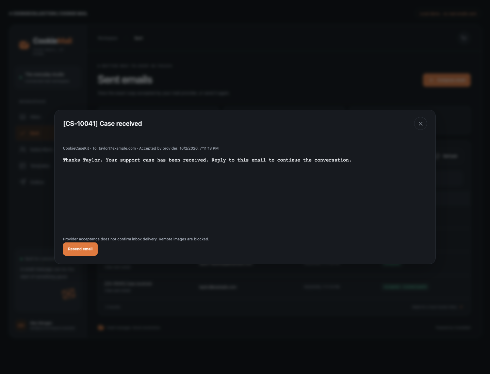

# CookieMail 2.2.0

Shared sent activity now supports confirmed transactional emails sent by CookieCaseKit or another trusted server component.

- Add server-only `recordSent(message)` with idempotent Message-ID/recipient identity and conflict detection.
- Show the originating application in Sent rows and the message reader.
- Imported messages can be viewed and explicitly resent; resends reference the original Message-ID so replies can still match the case thread.
- Importing a receipt never sends an email. Existing admin/viewer, tenant and origin rules continue to protect the private UI and API. No public receipt-writing endpoint is exposed.
- Refresh desktop/mobile screenshots with a CookieCaseKit notification.

Install `cookiemail@2.2.0` in server and React applications. For CookieCaseKit 1.2+, run `cases.syncSentEmails(tenant, message => mail.recordSent({...message, source: 'CookieCaseKit'}))` from the support worker. Existing confirmed CaseKit outbox records can backfill; do not import unconfirmed or failed attempts. No new secret or schema migration is required.

The Sent view combines CookieMail deliveries and explicitly imported transactional receipts. It does not scan an external provider's entire Sent folder or discover other SMTP clients automatically. Use the direct method for other trusted sending components; keep marketing sends on CookieMail's subscriber-aware queue.

[Mobile screenshot](screenshots/shared-case-email-mobile.png)
